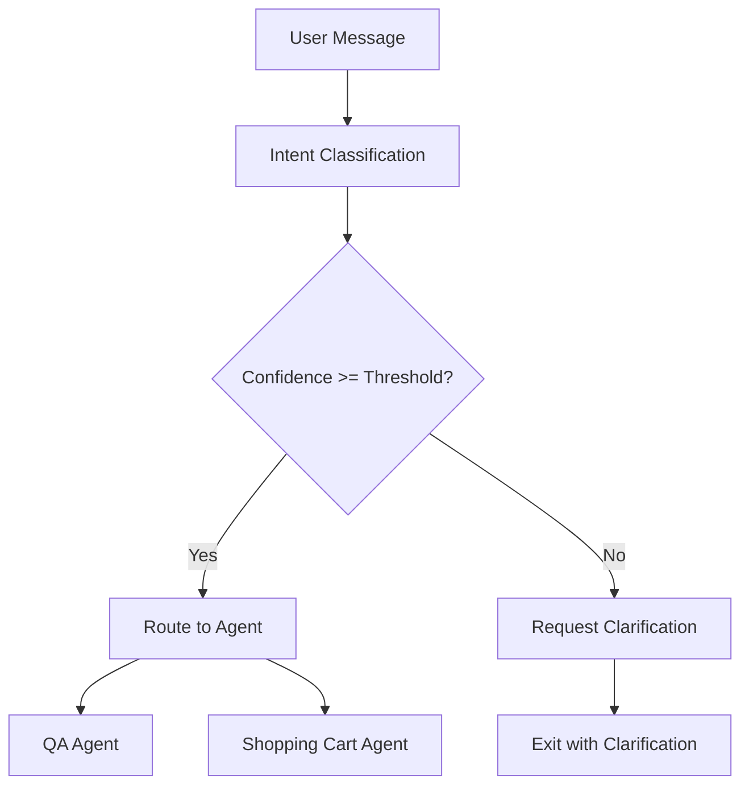

# Router Node Architecture and Intent Classification System

## Overview

The Router Node Architecture is the intelligent routing system that analyzes user intents and directs queries to appropriate specialized agents. This system implements a sophisticated intent classification mechanism with confidence-based routing, clarification handling, and fallback strategies to ensure optimal user experience.

## Architecture Components

### 1. Intent Classification System

#### Intent Classifier (`intent_classifier.py`)
The core component responsible for analyzing user messages and determining their intent.

**Key Features:**
- **Multi-pattern Analysis**: Uses keyword matching, context analysis, and semantic understanding
- **Confidence Scoring**: Provides confidence levels for routing decisions
- **Entity Extraction**: Identifies relevant entities (products, quantities, actions)
- **Context Awareness**: Considers conversation history for better classification

**Supported Intent Types:**
- `qa`: Product questions, comparisons, recommendations
- `cart`: Shopping cart operations (add, remove, list, clear)
- `unclear`: Ambiguous or unclassifiable intents

**Classification Process:**
1. **Preprocessing**: Clean and normalize input text
2. **Keyword Analysis**: Match against predefined patterns
3. **Context Integration**: Consider conversation history
4. **Confidence Calculation**: Score based on pattern strength and context
5. **Entity Extraction**: Identify relevant entities for the intent

#### Intent Result Model
```python
@dataclass
class IntentResult:
    intent: str                    # 'qa', 'cart', 'unclear'
    confidence: float             # 0.0 to 1.0
    entities: List[str]           # Extracted entities
    clarification_needed: bool    # Whether clarification is required
    suggested_questions: List[str] # Questions for clarification
    metadata: Dict[str, Any]      # Additional classification data
```

### 2. Router Node Implementation

#### Core Router Logic (`router_node.py`)
The main routing component that orchestrates intent classification and agent selection.

**Key Components:**
- **Intent Classification**: Analyzes user input to determine intent
- **Confidence Evaluation**: Compares confidence against thresholds
- **Routing Decisions**: Selects appropriate agent based on intent
- **Clarification Handling**: Manages unclear intents and user clarification

**Routing Flow:**


**Configuration Parameters:**
- `confidence_threshold`: Minimum confidence for routing (default: 0.7)
- `max_clarification_attempts`: Maximum clarification attempts (default: 3)
- `fallback_agent`: Default agent for unclear intents (default: "qa_agent")

### 3. Clarification Handling System

#### Clarification Handler (`clarification_handler.py`)
Manages ambiguous intents and guides users toward clearer communication.

**Features:**
- **Dynamic Question Generation**: Creates contextual clarification questions
- **Attempt Tracking**: Monitors clarification attempts per session
- **Fallback Strategies**: Provides alternatives when clarification fails
- **Context Preservation**: Maintains conversation context during clarification

**Clarification Strategies:**
1. **Specific Questions**: Ask about specific aspects (product, action, quantity)
2. **Option Presentation**: Provide multiple choice options
3. **Example Guidance**: Show example queries
4. **Fallback Routing**: Route to default agent after max attempts

### 4. Master Routing Graph

#### Graph Structure (`master_graph.py`)
The orchestration layer that coordinates all routing components.

**Graph Nodes:**
- `intent_classification_and_routing`: Main router node
- `product_qa_agent_execution`: QA agent execution
- `shopping_cart_agent_execution`: Cart agent execution
- `clarification_request_handling`: Clarification management
- `response_finalization_and_formatting`: Response processing

**Edge Logic:**
- **Conditional Routing**: Based on intent classification results
- **Clarification Exit**: Terminates graph after clarification requests
- **Error Fallback**: Routes to default agent on errors

## Intent Classification Patterns

### 1. Shopping Cart Intent Patterns

**Add to Cart Patterns:**
- Keywords: "add", "put", "include", "cart", "basket"
- Entities: Product names, quantities
- Context: Product discussion, comparison results

**Remove from Cart Patterns:**
- Keywords: "remove", "delete", "take out", "cart"
- Entities: Product names, quantities
- Context: Cart viewing, item management

**View Cart Patterns:**
- Keywords: "show", "view", "list", "cart", "basket"
- Context: Cart management, checkout preparation

### 2. QA Intent Patterns

**Product Search Patterns:**
- Keywords: "find", "search", "look for", "recommend"
- Entities: Product categories, specifications
- Context: Initial queries, exploration

**Comparison Patterns:**
- Keywords: "compare", "versus", "difference", "better"
- Entities: Multiple products, features
- Context: Decision making, evaluation

**Analysis Patterns:**
- Keywords: "analyze", "review", "opinion", "pros", "cons"
- Entities: Specific products
- Context: Detailed evaluation, research

### 3. Unclear Intent Handling

**Ambiguous Patterns:**
- Multiple possible intents detected
- Low confidence scores across all intents
- Incomplete information (missing entities)
- Contradictory signals

**Clarification Triggers:**
- Confidence below threshold (default: 0.7)
- Multiple high-confidence intents
- Missing required entities
- Context conflicts

## Performance Optimization

### 1. Intent Classification Caching

**Cache Strategy:**
- **Key Generation**: Hash of message text and context
- **TTL**: Configurable cache expiration (default: 1 hour)
- **Invalidation**: Context changes invalidate related cache entries
- **Memory Management**: LRU eviction for memory efficiency

**Implementation:**
```python
class IntentCache:
    def __init__(self, max_size: int = 1000, ttl: int = 3600):
        self.cache = {}
        self.max_size = max_size
        self.ttl = ttl
    
    def get_cached_intent(self, message: str, context_hash: str) -> Optional[IntentResult]:
        # Cache lookup with TTL validation
        pass
    
    def cache_intent(self, message: str, context_hash: str, result: IntentResult):
        # Store with timestamp and manage size
        pass
```

### 2. Routing Optimization

**Fast Path Routing:**
- **High Confidence**: Skip additional validation for very high confidence
- **Pattern Matching**: Use efficient regex compilation
- **Context Reuse**: Cache context extraction results

**Performance Metrics:**
- Classification time: < 50ms average
- Routing decision time: < 10ms average
- Cache hit rate: > 80% for repeated patterns

## Error Handling and Recovery

### 1. Classification Errors

**Error Types:**
- **Processing Errors**: Text parsing, normalization failures
- **Model Errors**: Classification algorithm failures
- **Context Errors**: Invalid or corrupted conversation context

**Recovery Strategies:**
- **Keyword Fallback**: Use simple keyword matching
- **Default Classification**: Assign default intent with low confidence
- **Error Logging**: Capture errors for analysis and improvement

### 2. Routing Errors

**Error Types:**
- **Agent Unavailability**: Target agent not responding
- **State Corruption**: Invalid routing state
- **Configuration Errors**: Invalid routing parameters

**Recovery Strategies:**
- **Fallback Agent**: Route to default QA agent
- **State Reset**: Clear corrupted routing state
- **Graceful Degradation**: Continue with reduced functionality

## Monitoring and Analytics

### 1. Routing Statistics

**Metrics Collected:**
- **Intent Distribution**: Frequency of each intent type
- **Confidence Scores**: Distribution of classification confidence
- **Routing Success Rate**: Percentage of successful routings
- **Clarification Rate**: Frequency of clarification requests
- **Agent Utilization**: Usage patterns across agents

**Example Statistics:**
```json
{
  "total_queries": 1000,
  "intent_distribution": {
    "qa": 650,
    "cart": 280,
    "unclear": 70
  },
  "average_confidence": 0.82,
  "clarification_rate": 0.07,
  "routing_success_rate": 0.95
}
```

### 2. Performance Monitoring

**Response Time Tracking:**
- Classification latency
- Routing decision time
- End-to-end processing time

**Resource Usage:**
- Memory consumption
- CPU utilization
- Cache performance

## Configuration Management

### 1. Router Configuration

```yaml
router:
  confidence_threshold: 0.7
  max_clarification_attempts: 3
  fallback_agent: "qa_agent"
  enable_caching: true
  cache_ttl: 3600
  cache_max_size: 1000

intent_classifier:
  enable_context_analysis: true
  context_window_size: 5
  entity_extraction: true
  confidence_boost_threshold: 0.8

clarification:
  max_questions: 3
  enable_examples: true
  fallback_after_attempts: true
```

### 2. Pattern Configuration

```yaml
cart_patterns:
  add_keywords: ["add", "put", "include", "cart", "basket"]
  remove_keywords: ["remove", "delete", "take out"]
  view_keywords: ["show", "view", "list", "cart"]

qa_patterns:
  search_keywords: ["find", "search", "look for", "recommend"]
  compare_keywords: ["compare", "versus", "difference", "better"]
  analyze_keywords: ["analyze", "review", "opinion", "pros", "cons"]
```

## Integration Points

### 1. Agent Integration

**QA Agent Integration:**
- Receives product-related queries
- Uses MCP tools for external data
- Returns structured product information

**Shopping Cart Agent Integration:**
- Receives cart operation requests
- Uses function calling tools
- Manages persistent cart state

### 2. State Management Integration

**Conversation State:**
- Stores routing decisions and metadata
- Maintains clarification history
- Tracks agent usage patterns

**Cart State:**
- Integrates with cart database operations
- Maintains session isolation
- Provides real-time cart updates

## Testing Strategy

### 1. Unit Testing

**Intent Classification Tests:**
- Pattern matching accuracy
- Confidence score validation
- Entity extraction correctness
- Context integration effectiveness

**Router Logic Tests:**
- Routing decision accuracy
- Threshold handling
- Error recovery mechanisms
- State management

### 2. Integration Testing

**End-to-End Routing:**
- Complete user journey testing
- Multi-turn conversation handling
- Agent switching scenarios
- Error propagation testing

**Performance Testing:**
- Load testing with concurrent users
- Response time validation
- Memory usage monitoring
- Cache effectiveness measurement

## Best Practices

### 1. Development Guidelines

- **Pattern Maintenance**: Regularly update intent patterns based on user feedback
- **Threshold Tuning**: Adjust confidence thresholds based on production data
- **Error Handling**: Implement comprehensive error recovery
- **Performance Monitoring**: Track and optimize classification performance

### 2. Deployment Considerations

- **Configuration Management**: Use environment-specific configurations
- **Monitoring Setup**: Implement comprehensive monitoring and alerting
- **Gradual Rollout**: Deploy routing changes incrementally
- **Fallback Planning**: Ensure robust fallback mechanisms

## Future Enhancements

### 1. Machine Learning Integration

- **Advanced Classification**: Use ML models for better intent recognition
- **Personalization**: Adapt routing based on user behavior patterns
- **Continuous Learning**: Improve classification from user feedback

### 2. Multi-Modal Support

- **Voice Input**: Support voice-based intent classification
- **Image Analysis**: Analyze product images for intent context
- **Gesture Recognition**: Support gesture-based interactions

### 3. Advanced Analytics

- **User Journey Analysis**: Track complete user interaction patterns
- **A/B Testing**: Test different routing strategies
- **Predictive Routing**: Anticipate user intents based on context

## Conclusion

The Router Node Architecture provides a sophisticated and scalable foundation for intelligent query routing. Its combination of intent classification, confidence-based routing, and comprehensive error handling ensures reliable and efficient user experience while maintaining flexibility for future enhancements.